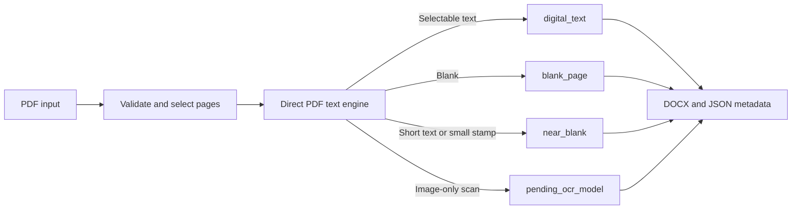

# Clouda PDF

Clouda PDF is an open-source, model-agnostic PDF-to-DOCX project for Arabic, English, and mixed-language documents. Its long-term goal is reliable Arabic OCR for modern and historical books, including weak or medium-quality scanned pages, margins, footnotes, RTL text, and mixed Arabic-English reading order.

The current verified implementation converts born-digital PDF documents into editable, text-only DOCX files while preserving page order, Arabic Unicode, RTL paragraph direction, footers, and page boundaries. Image-only scanned pages are detected and routed to `pending_ocr_model`; they are not treated as successful OCR output until a final OCR model is selected, integrated, and measured.

It is designed for modern and historical Arabic books as well as English and mixed-language documents. Text fidelity is the priority. The project does not currently attempt layout-perfect reconstruction of images, tables, or page artwork.

## Why it exists

Researchers, publishers, and archives need editable documents without silently losing page context or implying OCR accuracy that has not been measured. Clouda PDF makes the supported digital-text path explicit and preserves uncertain pages for review.

## Current capabilities

- Extract selectable text from born-digital PDF pages without OCR.
- Generate a valid editable DOCX with page breaks and RTL-aware Arabic paragraphs.
- Classify pages as `digital_text`, `blank_page`, `near_blank`, or `pending_ocr_model` and record per-page metadata.
- Preserve short page-number text rather than discarding it.
- Use a model-agnostic `ExtractionEngine` and `EngineRegistry` for a future OCR integration.
- Keep scanned, low-quality, and image-only pages in an explicit review state instead of claiming unmeasured OCR accuracy.



## Install (Windows)

```powershell
py -3.11 -m venv .venv311
.\.venv311\Scripts\python.exe -m pip install --upgrade pip
.\.venv311\Scripts\python.exe -m pip install -r requirements-dev.txt
```

## Run

```powershell
.\.venv311\Scripts\python.exe -m streamlit run app.py
```

Open `http://127.0.0.1:8501`.

## Test and validate

```powershell
.\.venv311\Scripts\python.exe -m pytest --cov=pdfword --cov-report=term-missing
.\.venv311\Scripts\python.exe -m ruff check .
.\.venv311\Scripts\python.exe -m black --check .
.\.venv311\Scripts\python.exe -m mypy .
```

Verified on 2026-07-14: `146 passed` with `81%` overall `pdfword` coverage. Ruff, Black, mypy, and compile validation pass across the project.

## External tools

Do not commit Poppler, OCR runtimes, virtual environments, or GPU toolkits into this repository. If a future workflow needs Poppler, install it outside the repo and add its `bin` directory to `PATH`, for example `C:\tools\poppler\Library\bin`.

## Demo

The demo processes copyright-free local fixtures and writes a DOCX plus per-page JSON metadata:

```powershell
.\.venv311\Scripts\python.exe scripts\demo.py
```

It demonstrates digital text extraction, DOCX generation, a scanned page routed to `pending_ocr_model`, and a blank page routed to `blank_page`.

## Example outcome

| Input page | Result | Output |
| --- | --- | --- |
| PDF page with selectable text | `digital_text` | Extracted text in DOCX |
| Image-only scanned page | `pending_ocr_model` | Explicit review state and JSON metadata |
| Empty page | `blank_page` | Page boundary retained |
| Page number or small stamp | `near_blank` | Original short content retained for review |

## Current limitations

- A final OCR model has not been selected, installed, or integrated.
- Scanned-page OCR, CER, and WER results are not claimed. They require real ground-truth evaluation.
- Layout-perfect reconstruction, tables, images, margins, and footnotes are not rebuilt as DOCX objects; page boundaries and extracted text are retained.
- AMD/ROCm readiness is architectural and diagnostic only. No GPU inference or training has been validated.
- Qwen, Kraken, PaddleOCR, Tesseract, and other OCR candidates are benchmark candidates only until legally usable, installed, and evaluated on the same ground-truth set.

## Roadmap

See [ROADMAP.md](ROADMAP.md), [docs/ROADMAP.md](docs/ROADMAP.md), and [docs/MODEL_INTEGRATION.md](docs/MODEL_INTEGRATION.md). The final OCR engine will be selected only after a documented benchmark and ground-truth evaluation.

## Documentation

- [Architecture](docs/ARCHITECTURE.md)
- [Testing](docs/TESTING.md)
- [Model integration](docs/MODEL_INTEGRATION.md)
- [Data licenses](DATA_LICENSES.md)
- [Third-party notices](THIRD_PARTY_NOTICES.md)
- [Security](SECURITY.md)
- [Contributing](CONTRIBUTING.md)

## License

See [LICENSE](LICENSE).
